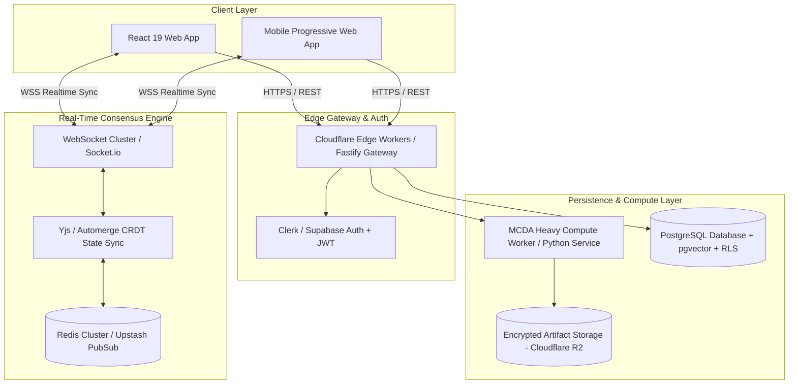
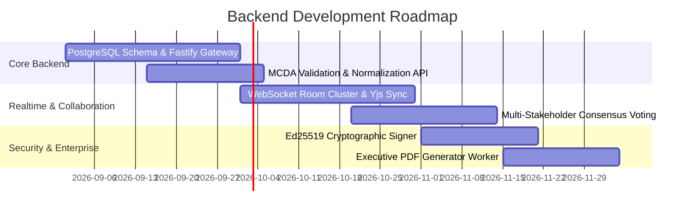

# Decision OS — Future Backend Architecture Specification (Phase 2 Roadmap)

> **Vision**: Transform Decision OS from a client-side decision studio into an **enterprise-grade collaborative decision intelligence platform** with cloud persistence, real-time consensus rooms, cryptographic audit trails, and multi-stakeholder governance.

---

## 1. Architectural Overview & Design Goals

While Decision OS currently runs entirely on the client for maximum privacy and zero latency, Phase 2 introduces a **lightweight, high-throughput, edge-first backend** designed around four core pillars:

1. **Zero-Latency Reactive Collaboration**: Multi-stakeholder decision rooms where executive teams or hiring committees calibrate weights simultaneously with sub-50ms sync.
2. **Cryptographic Tamper-Evident Audit Trails**: Every weight adjustment, vote, and final decision produces a signed SHA-256 Merkle proof for compliance and post-mortem reviews.
3. **Enterprise Role-Based Access Control (RBAC)**: Workspaces, private decision templates, stakeholder voting modes, and secret criteria weighting.
4. **Zero-Knowledge / Ephemeral Mode**: Privacy-preserving decision rooms where data is processed in memory and deleted immediately after briefing generation.



---

## 2. Proposed Technology Stack

| Layer | Technology | Rationale |
| :--- | :--- | :--- |
| **API Gateway** | Cloudflare Workers / Node.js Fastify | Sub-10ms global edge latency, minimal cold starts |
| **Database** | PostgreSQL (Neon / Supabase) | Relational integrity, JSONB support, strict Row-Level Security (RLS) |
| **Real-Time Engine** | Yjs CRDTs + WebSockets | Conflict-free real-time multi-cursor slider calibration |
| **Pub/Sub Cache** | Redis (Upstash) | Ephemeral session state, rate limiting, room broadcasting |
| **Cryptographic Signer** | Web Crypto API (Ed25519) | Tamper-evident verified decision certificate signing |
| **Export Worker** | Puppeteer / Chromium Serverless | High-resolution PDF decision briefings & executive pitch decks |

---

## 3. Database Schema Design (PostgreSQL DDL)

```sql
-- 1. Organizations / Workspaces
CREATE TABLE workspaces (
    id UUID PRIMARY KEY DEFAULT gen_random_uuid(),
    name VARCHAR(255) NOT NULL,
    slug VARCHAR(100) UNIQUE NOT NULL,
    created_at TIMESTAMP WITH TIME ZONE DEFAULT NOW(),
    updated_at TIMESTAMP WITH TIME ZONE DEFAULT NOW()
);

-- 2. User Accounts & Organization Members
CREATE TABLE users (
    id UUID PRIMARY KEY DEFAULT gen_random_uuid(),
    email VARCHAR(255) UNIQUE NOT NULL,
    full_name VARCHAR(255),
    avatar_url TEXT,
    created_at TIMESTAMP WITH TIME ZONE DEFAULT NOW()
);

CREATE TABLE workspace_members (
    workspace_id UUID REFERENCES workspaces(id) ON DELETE CASCADE,
    user_id UUID REFERENCES users(id) ON DELETE CASCADE,
    role VARCHAR(50) DEFAULT 'member' CHECK (role IN ('owner', 'admin', 'editor', 'viewer')),
    PRIMARY KEY (workspace_id, user_id)
);

-- 3. Decisions
CREATE TABLE decisions (
    id UUID PRIMARY KEY DEFAULT gen_random_uuid(),
    workspace_id UUID REFERENCES workspaces(id) ON DELETE CASCADE,
    title VARCHAR(255) NOT NULL,
    description TEXT,
    category VARCHAR(100) DEFAULT 'career',
    status VARCHAR(50) DEFAULT 'draft' CHECK (status IN ('draft', 'deliberating', 'resolved', 'archived')),
    winning_option_id UUID,
    confidence_score NUMERIC(5,2),
    verification_hash VARCHAR(64),
    created_by UUID REFERENCES users(id),
    created_at TIMESTAMP WITH TIME ZONE DEFAULT NOW(),
    updated_at TIMESTAMP WITH TIME ZONE DEFAULT NOW()
);

-- 4. Criteria
CREATE TABLE criteria (
    id UUID PRIMARY KEY DEFAULT gen_random_uuid(),
    decision_id UUID REFERENCES decisions(id) ON DELETE CASCADE,
    name VARCHAR(255) NOT NULL,
    short_name VARCHAR(50) NOT NULL,
    category VARCHAR(50) NOT NULL,
    description TEXT,
    weight NUMERIC(5,2) NOT NULL CHECK (weight >= 0 AND weight <= 100),
    is_locked BOOLEAN DEFAULT FALSE,
    display_order INT DEFAULT 0
);

-- 5. Options
CREATE TABLE options (
    id UUID PRIMARY KEY DEFAULT gen_random_uuid(),
    decision_id UUID REFERENCES decisions(id) ON DELETE CASCADE,
    name VARCHAR(255) NOT NULL,
    badge VARCHAR(100),
    description TEXT,
    color VARCHAR(20) DEFAULT '#B8FF5A',
    strengths TEXT[],
    vulnerabilities TEXT[],
    display_order INT DEFAULT 0
);

-- 6. Option Capability Scores Matrix
CREATE TABLE option_scores (
    option_id UUID REFERENCES options(id) ON DELETE CASCADE,
    criterion_id UUID REFERENCES criteria(id) ON DELETE CASCADE,
    raw_score INT NOT NULL CHECK (raw_score >= 0 AND raw_score <= 100),
    notes TEXT,
    PRIMARY KEY (option_id, criterion_id)
);

-- 7. Multi-Stakeholder Consensus Votes
CREATE TABLE consensus_votes (
    id UUID PRIMARY KEY DEFAULT gen_random_uuid(),
    decision_id UUID REFERENCES decisions(id) ON DELETE CASCADE,
    stakeholder_id UUID REFERENCES users(id) ON DELETE CASCADE,
    custom_weights JSONB NOT NULL, -- Key-value map of criterion_id -> weight
    voted_winner_id UUID REFERENCES options(id),
    created_at TIMESTAMP WITH TIME ZONE DEFAULT NOW()
);

-- 8. Tamper-Evident Audit Log (Merkle Ledger)
CREATE TABLE decision_audit_logs (
    id UUID PRIMARY KEY DEFAULT gen_random_uuid(),
    decision_id UUID REFERENCES decisions(id) ON DELETE CASCADE,
    actor_id UUID REFERENCES users(id),
    event_type VARCHAR(100) NOT NULL, -- e.g. 'WEIGHT_CHANGED', 'OPTION_ADDED', 'DECISION_FINALIZED'
    payload JSONB NOT NULL,
    previous_hash VARCHAR(64) NOT NULL,
    current_hash VARCHAR(64) NOT NULL,
    created_at TIMESTAMP WITH TIME ZONE DEFAULT NOW()
);
```

---

## 4. REST & WebSocket API Specification

### REST Endpoints

#### 1. Decisions
- `GET /api/v1/workspaces/:wsId/decisions` — List all decisions in workspace.
- `POST /api/v1/workspaces/:wsId/decisions` — Create a new decision matrix.
- `GET /api/v1/decisions/:id` — Fetch complete decision state (criteria, options, scores, and latest evaluation).
- `PUT /api/v1/decisions/:id/weights` — Update criteria weights with atomic validation.
- `POST /api/v1/decisions/:id/resolve` — Freeze decision, generate verification hash, and sign certificate.

#### 2. Advanced Analytics & Stress Testing
- `POST /api/v1/decisions/:id/monte-carlo` — Run high-iteration (10,000+ passes) distributed Monte Carlo simulation.
- `POST /api/v1/decisions/:id/export/pdf` — Generate boardroom-ready executive PDF pass.

---

### Real-Time WebSocket Events (`/ws/decisions/:id`)

```json
// 1. Client sends weight adjustment:
{
  "event": "WEIGHT_UPDATE",
  "criterionId": "crit_comp_01",
  "newWeight": 35.0,
  "lockedIds": ["crit_growth_02"]
}

// 2. Server broadcasts normalized state to all connected room members:
{
  "event": "STATE_SYNC",
  "weights": {
    "crit_comp_01": 35.0,
    "crit_growth_02": 30.0,
    "crit_learning_03": 15.0,
    "crit_wlb_04": 12.0,
    "crit_stability_05": 8.0
  },
  "evaluations": [
    { "optionId": "opt_alpha", "score": 81.2, "rank": 1 },
    { "optionId": "opt_beta", "score": 80.5, "rank": 2 }
  ],
  "updatedBy": "user_usr9482"
}
```

---

## 5. Security, Verification & Zero-Knowledge Architecture

### 1. Cryptographic Decision Signatures (Merkle Proofs)
When a decision is finalized (`status = 'resolved'`), the backend creates an immutable snapshot:
$$\text{Hash} = \text{SHA256}(\text{WorkspaceID} \mathbin{\Vert} \text{DecisionID} \mathbin{\Vert} \text{WeightsJSON} \mathbin{\Vert} \text{ScoresJSON} \mathbin{\Vert} \text{Timestamp})$$
This hash is signed using an **Ed25519 private key** belonging to the organization and stamped onto the **Decision Ticket**. Anyone can verify the decision was not retroactively tampered with using the public verification endpoint `https://decision-os.com/verify/:hash`.

### 2. Zero-Knowledge / Ephemeral Rooms
For highly sensitive M&A deliberations, executive compensation reviews, or private personal decisions:
- The server initializes an **in-memory WebSocket session**.
- State is synchronized between clients using end-to-end encrypted CRDT packets.
- No criteria, weights, or option data are written to the database.
- Upon session termination, all server memory buffers are flushed immediately.

---

## 6. Phase 2 Implementation Milestones


