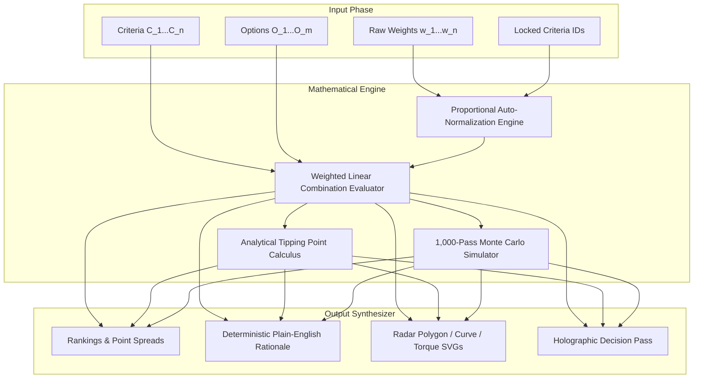

# Decision OS — Comprehensive Product Specification

> **Tagline**: Make decisions you can explain.  
> **Product Category**: Structured Decision-Support Workspace (MCDA Engine).

---

## 1. Executive Summary & The Problem Space

### The Core Dilemma of High-Stakes Decisions
Every day, professionals, founders, and engineering leaders face high-stakes, multi-variable choices:
- *“Should I leave my stable Tier-1 tech job for a high-equity Series B AI startup?”*
- *“Should we relocate to Austin for zero state income tax or stay in NYC for tech density?”*
- *“Should our engineering organization adopt Vite + React SPA or Next.js Server Components for our 2026 stack?”*

When humans attempt to resolve these dilemmas unassisted, they encounter four severe cognitive failure modes:

1. **Salary / Single-Metric Anchoring**:
   - People disproportionately fixate on easily quantifiable metrics (e.g. `$240,000` base salary) while neglecting harder-to-measure but critical factors (e.g., promotional velocity, engineering culture, or work-life balance).
2. **Analysis Paralysis & Scattered Notes**:
   - Decision-makers produce fragmented Google Docs, disjointed Notion pros/cons lists, and chaotic mental deliberations that lead to emotional exhaustion and stalled action.
3. **Black-Box AI Skepticism**:
   - Modern LLMs often act as generic "oracles" that declare *"You should choose Option A!"* without showing transparent mathematical weights or personal trade-off drivers. Users cannot defend an AI recommendation to a board, partner, or executive team.
4. **Stakeholder Communication Breakdown**:
   - Even when a decision is made intuitively, the decider cannot articulate *why* it was chosen or what trade-offs were accepted.

---

## 2. What Decision OS Solves

**Decision OS bridges the gap between chaotic gut feelings and opaque AI predictions.**

It introduces a **structured, deterministic decision-support system** based on **Multi-Criteria Decision Analysis (MCDA)**.

| Unstructured Approach (Pros/Cons & Notes) | Black-Box AI ("Oracle") | Decision OS |
| :--- | :--- | :--- |
| Emotionally biased towards recent events | Opaque weights, hallucinated logic | **100% Deterministic linear algebra** |
| Ignores relative criteria importance | Cannot explain *why* Option A won | **Proportional priority calibration (100% sum)** |
| Fails to reveal tipping points | Non-reproducible answers | **Exact analytical sensitivity tipping calculation** |
| Hard to explain to stakeholders | Unverifiable claims | **Boardroom-ready verified briefing pass with hash** |

---

## 3. What Decision OS Does (Core Capabilities)

### 1. Multi-Criteria Priority Calibration
- Users define 4–6 explicit criteria (e.g. *Career Growth*, *Compensation*, *Learning*, *Work-Life Balance*, *Stability*).
- Users drag priority sliders to calibrate how much each factor matters.
- An **auto-normalization algorithm** continuously scales unlocked sliders so the total weight always strictly equals $100\%$, while preserving user-locked constraints.

### 2. Live Mathematical Evaluation & Point Spread
- Calculates weighted multi-criteria scores in real-time ($<1\text{ms}$).
- Displays rank positions (#1 Winner, #2 Runner-up, #3 Alternative) and exact point differentials.

### 3. Analytical Sensitivity & Tipping-Point Discovery
- Calculates the exact analytical weight $w_k^*$ where the ranking inverts:
  > *"If Compensation weight shifts from 25% to 36.4% (+11.4%), Company Beta overtakes Company Alpha."*
- Includes a 1-click **Apply Breakeven** button to stress-test the alternative reality.

### 4. Deep Analytical Visual Instruments
- **Multi-Axis Radar Polygon**: 5-axis geometric spider chart showing dimensional coverage with dynamic weight markers.
- **Continuous Breakeven Curve**: Continuous coordinate line plot showing score cross-sections across $w \in [0, 100\%]$.
- **Physical Torque Balance Scale**: Animated mechanical scale that tilts in degrees based on weighted torque differentials $\tau = \sum w_i(s_{Ai} - s_{Bi})$.
- **1,000-Pass Gaussian Monte Carlo Tester**: Injects randomized Gaussian noise into criteria weights to calculate empirical victory probabilities and confidence ratings (*High Confidence* vs *Sensitive*).

### 5. Boardroom-Ready Verified Decision Briefing
- Produces a holographic briefing pass with an official serial code, verification checksum hash, timestamp, and 1-click copy-to-clipboard markdown briefing.

---

## 4. How Decision OS Works (Mathematical Architecture)

### Mathematical Foundations

#### 1. Linear Multi-Criteria Scoring Function
$$\text{Score}(O_j) = \sum_{i=1}^n \left( \frac{w_i}{100} \right) \cdot s_{ij}$$
Where:
- $w_i \in [0, 100]$ is the weight of criterion $i$, normalized such that $\sum_{i=1}^n w_i = 100\%$.
- $s_{ij} \in [0, 100]$ is the raw capability score of Option $j$ on criterion $i$.

#### 2. Proportional Auto-Normalization Algorithm
When an unlocked slider $k$ is adjusted to $w_k^{\text{new}}$:
- $L$ = set of locked criteria.
- $U$ = set of unlocked criteria.
- Target remaining weight for $U \setminus \{k\}$ is:
$$W_{\text{rem}} = 100 - \sum_{l \in L} w_l - w_k^{\text{new}}$$
- Each unlocked criterion $i \in U \setminus \{k\}$ is updated:
$$w_i^{\text{new}} = w_i^{\text{old}} \cdot \left( \frac{W_{\text{rem}}}{\sum_{j \in U \setminus \{k\}} w_j^{\text{old}}} \right)$$

#### 3. Analytical Sensitivity Tipping Equation
For leading option $A$ and challenger option $B$, we solve for the exact critical weight $w_k^*$ where $\text{Score}(A) = \text{Score}(B)$:
$$\Delta R = \sum_{i \neq k} w_i^{\text{current}} \cdot (s_{Ai} - s_{Bi})$$
$$w_k^* = \frac{100 \cdot \Delta R}{\Delta R - (s_{Ak} - s_{Bk}) \cdot (100 - w_k^{\text{current}})}$$
If $w_k^* \in (0, 95\%]$, the tipping threshold is reachable.

---

## 5. Core Product Principles

1. **The Best Decision Depends on What Matters to You**:
   There is no universal "best" job offer or tech framework in a vacuum. A startup offer is superior for career acceleration; an enterprise offer is superior for immediate liquid compensation. Decision OS makes priorities explicit.
2. **Deterministic Arithmetic Over Hallucinated AI**:
   Outputs are generated through exact linear algebra, not generative text guesswork. Every score can be audited down to the decimal point.
3. **Progressive Disclosure & Clarity**:
   Complex multi-dimensional geometry and sensitivity calculus are presented in dedicated, spacious instruments so users never experience cognitive clutter.
4. **Human-in-the-Loop Agency**:
   The system never makes choices *for* the user. It functions as a precision instrument that clarifies trade-offs and leaves ultimate authority with the human decider.

---

## 6. Target User Personas

1. **The Mid-to-Senior Professional**:
   - Evaluating 2–3 competing job offers (Startup equity vs Enterprise cash vs Remote lifestyle).
   - Needs a clear framework to discuss trade-offs with family or mentors.
2. **The Engineering Lead / CTO**:
   - Selecting architectural foundations (e.g. Next.js vs Vite SPA, AWS vs GCP).
   - Needs an airtight, defensible briefing for executive presentations.
3. **The Founder / Executive**:
   - Evaluating vendor contracts, term sheets, or office relocation markets.
   - Needs to identify sensitivity tipping points before committing capital.
