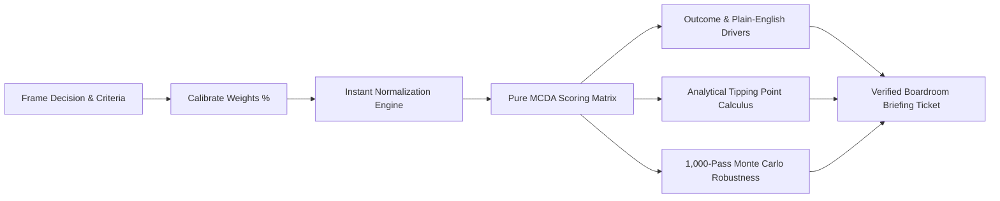

# Decision OS

<div align="center">

```
  ____            _     _               ___  ____  
 |  _ \  ___  ___(_)___(_) ___  _ __   / _ \/ ___| 
 | | | |/ _ \/ __| / __| |/ _ \| '_ \ | | | \___ \ 
 | |_| |  __/ (__| \__ \ | (_) | | | || |_| |___) |
 |____/ \___|\___|_|___/_|\___/|_| |_(_)___/|____/ 
```

### **Make decisions you can explain.**

A high-craft, deterministic decision-support workspace built on **Multi-Criteria Decision Analysis (MCDA)**.  
Turns complex, multi-factor dilemmas into transparent, defensible choices driven by what actually matters to you.

[](https://www.typescriptlang.org/)
[](https://react.dev/)
[](https://vitejs.dev/)
[](https://tailwindcss.com/)
[](https://vitest.dev/)

[Explore Live Demo](#-quickstart) • [Product Specification](./PROJECT_SPECIFICATION.md) • [Future Backend Architecture](./FUTURE_BACKEND_ARCHITECTURE.md) • [Engineering Decisions](./DECISIONS.md)

</div>

---

## 🌟 The Core Idea

Most important decisions (career choices, city relocations, technical architecture) are not simple binary questions. They involve **competing trade-offs** across multiple criteria:

> *"Company Alpha offers rapid growth and ownership, but lower cash. Company Beta offers high salary, but corporate bureaucracy. Which should I pick?"*

**Decision OS** rejects black-box AI oracles that simply output "do X" without justification. Instead, it provides a transparent mathematical model where:
1. **You define what matters** (proportional criteria weights summing to 100%).
2. **Options are evaluated transparently** ($S_j = \sum w_i \cdot s_{ij}$).
3. **Analytical tipping points reveal sensitivity** (the exact point where the winner flips).



---

## 🚀 Key Features

### 1. 🎛️ Command Console Hero
- Interactive 3-option comparison console (Company Alpha vs Beta vs Gamma).
- Instant priority stress-testing pills (*Career Growth*, *Compensation*, *Work-Life Focus*) demonstrating how shifting priorities invert the leading recommendation in real-time.

### 2. 📡 Live Decision Telemetry Ribbon
- Monospace real-time ticker displaying active leader score, point spread lead, and tipping status.

### 3. 🔬 Deep Analytical Studio Instruments
Instead of buried tabs, Decision OS features a dedicated laboratory with 4 specialized visual instruments:
* **📊 Multi-Axis Radar Polygon**: 5-axis SVG spider chart showing geometric dimensional coverage with dynamic spoke weight markers.
* **📈 Continuous Sensitivity Breakeven Curve**: Continuous coordinate graph solving the exact intersection point where the runner-up overtakes the winner, with a 1-click **Apply Breakeven** button.
* **⚖️ Trade-off Torque Balance Scale**: Physical balance beam that calculates net torque delta $\tau = \sum w_i(s_{Ai} - s_{Bi})$ and dynamically tilts in degrees.
* **🎲 1,000-Pass Gaussian Monte Carlo Tester**: Statistical robustness simulator that injects randomized priority noise ($\pm 10\%$, $\pm 15\%$, $\pm 25\%$) across 1,000 iterations to measure empirical confidence.

### 4. 🎫 Boardroom-Ready Verified Decision Briefing Pass
- Holographic ticket pass containing decision parameters, verification hash (`0x8F92...B8FF5A`), QR barcode, and 1-click copy-to-clipboard summary for mentors or stakeholders.

### 5. 📚 Real-World Scenario Case Studies
- Editorial case studies with high-fidelity visual assets:
  - **Career Velocity**: Startup equity vs Tier-1 enterprise cash.
  - **Urban Relocation**: Austin vs NYC vs Lisbon (tax savings, tech density, Atlantic lifestyle).
  - **Frontend Architecture**: Vite SPA velocity vs Next.js Server Components.
- 1-click **Simulate Model** action that loads pre-configured parameters into the sandbox.

### 6. 🧭 Interactive Product Tour Onboarding Walkthrough
- 5-step guided walkthrough that auto-launches on first visit with smooth contextual auto-scrolling to active page sections.
- Persistent "Guide Tour" trigger in the top navbar and footer.

### 7. 🔊 Synthesized Tactile Web Audio Engine
- Built-in Web Audio API synthesizer that produces mechanical slider ticks and harmonic chords on scenario presets with zero external audio assets.

---

## 📐 Mathematical Model & Algorithms

### 1. Weighted Linear Combination (MCDA)
$$\text{Score}(O_j) = \sum_{i=1}^n \left( \frac{w_i}{100} \right) \cdot s_{ij}$$
Where $w_i \in [0, 100]$ is the weight of criterion $i$ such that $\sum_{i=1}^n w_i = 100\%$, and $s_{ij} \in [0, 100]$ is the score of Option $j$ on criterion $i$.

### 2. Proportional Auto-Normalization with Locked Constraints
When an unlocked slider $k$ is adjusted to $w_k^{\text{new}}$, the remaining unlocked sliders $U \setminus \{k\}$ are scaled proportionally:
$$w_i^{\text{new}} = w_i^{\text{old}} \cdot \left( \frac{100 - \sum_{l \in L} w_l - w_k^{\text{new}}}{\sum_{j \in U \setminus \{k\}} w_j^{\text{old}}} \right)$$
*Guarantees total weight is strictly 100% while preserving user-locked constraints.*

### 3. Exact Sensitivity Tipping Point Formula
For leading option $A$ and runner-up $B$, the tipping weight $w_k^*$ for criterion $k$ where $\text{Score}(A) = \text{Score}(B)$ is solved analytically by:
$$w_k^* = \frac{100 \cdot \Delta R}{\Delta R - (s_{Ak} - s_{Bk}) \cdot (100 - w_k^{\text{current}})}$$
Where $\Delta R = \sum_{i \neq k} w_i^{\text{current}} \cdot (s_{Ai} - s_{Bi})$. If $w_k^* \in (0, 95\%]$, a single-criterion tipping point is reachable.

---

## 🛠️ Quickstart & Local Development

### Prerequisites
* **Node.js**: v18.0.0 or higher
* **npm**: v9.0.0 or higher

### 1. Clone & Install
```bash
git clone https://github.com/<YOUR_USERNAME>/decision-os.git
cd decision-os
npm install
```

### 2. Start Local Development Server
```bash
npm run dev
```
Open [http://localhost:5173](http://localhost:5173) in your browser.

### 3. Run Automated Unit Tests
```bash
npx vitest run
```

### 4. Build for Production
```bash
npm run build
```
The optimized production bundle will be generated in `dist/`.

---

## 🏗️ Project Structure

```text
├── public/
│   ├── images/              # Editorial scenario artwork & case studies
│   ├── logo.png             # Decision OS brand mark
│   └── favicon.svg          # Favicon
├── src/
│   ├── components/
│   │   ├── BalanceBeam.tsx             # Physical torque balance scale
│   │   ├── CaseStudies.tsx             # Editorial scenario showcase
│   │   ├── DecisionDemo.tsx            # Core interactive Decision Studio
│   │   ├── DecisionHistoryTimeline.tsx # 4-stage decision evolution timeline
│   │   ├── DecisionTicker.tsx          # Real-time telemetry ribbon
│   │   ├── DecisionTicket.tsx          # Boardroom verified briefing pass
│   │   ├── EasterEgg.tsx               # Matrix audit terminal (⌘K)
│   │   ├── FinalCTA.tsx                # Bottom call-to-action
│   │   ├── Footer.tsx                  # Unified footer
│   │   ├── Hero.tsx                    # Command console hero
│   │   ├── HowItWorks.tsx              # 3-step workflow
│   │   ├── InstrumentsShowcase.tsx     # Deep analytical studio showcase
│   │   ├── InteractiveModal.tsx        # Custom decision sandbox workspace
│   │   ├── Logo.tsx                    # Vector isometric decision prism logo
│   │   ├── MonteCarloTester.tsx        # 1,000-pass Gaussian noise simulator
│   │   ├── Navbar.tsx                  # Sticky top navigation
│   │   ├── Principles.tsx              # Core product tenets
│   │   ├── ProblemSection.tsx          # Cognitive friction breakdown
│   │   ├── ProductTour.tsx             # Interactive onboarding walkthrough
│   │   ├── RadarChart.tsx              # 5-axis SVG radar polygon visualizer
│   │   ├── ScenarioSwitcher.tsx        # Preset scenario selector
│   │   ├── ScoreCard.tsx               # Option score breakdown card
│   │   ├── ScrollToTop.tsx             # Floating back-to-top navigation arrow
│   │   ├── SensitivityBar.tsx          # Tipping point analysis bar
│   │   ├── SensitivityCurve.tsx        # Continuous breakeven line graph
│   │   ├── TransparencySection.tsx     # Deterministic breakdown
│   │   └── WeightSlider.tsx            # Interactive range slider with lock
│   ├── data/
│   │   └── decisionData.ts             # Default matrices (Job Offer, Relocation, Architecture)
│   ├── hooks/
│   │   └── useDecisionModel.ts         # React state coordinator hook
│   ├── types/
│   │   └── decision.ts                 # TypeScript interfaces
│   ├── utils/
│   │   ├── audioFx.ts                  # Web Audio synthesizer
│   │   ├── decisionEngine.ts           # Pure MCDA arithmetic & tipping equations
│   │   └── decisionEngine.test.ts      # Vitest unit test suite (6/6 passing)
│   ├── App.tsx                         # Root narrative coordinator
│   ├── index.css                       # Tailwind v4 theme tokens & responsive styles
│   └── main.tsx                        # Application entry point
├── DECISIONS.md                        # Product thesis & assessment answers
├── FUTURE_BACKEND_ARCHITECTURE.md      # Phase 2 backend & real-time collaboration spec
├── PROJECT_SPECIFICATION.md            # In-depth product specification
├── package.json
└── tsconfig.json
```

---

## ⚡ Tech Stack

| Layer | Technology | Rationale |
| :--- | :--- | :--- |
| **Framework** | React 19 + TypeScript | Strict compile-time typing for mathematical integrity |
| **Build Tool** | Vite 6 | Sub-50ms Hot Module Replacement (HMR) and optimized rollup |
| **Styling** | Tailwind CSS v4 | CSS theme tokens (`@theme`), responsive fluid utilities |
| **Motion** | Framer Motion | 60fps hardware-accelerated animations and spring physics |
| **Audio** | Web Audio API | Zero-dependency synthesized tactile micro-feedback |
| **Testing** | Vitest | Fast automated arithmetic and edge-case unit testing |

---

## 📄 License & Attribution

Built for the **Frontend Engineering & Product Design Challenge**.  
© 2026 **Decision OS**. Make decisions you can explain.
